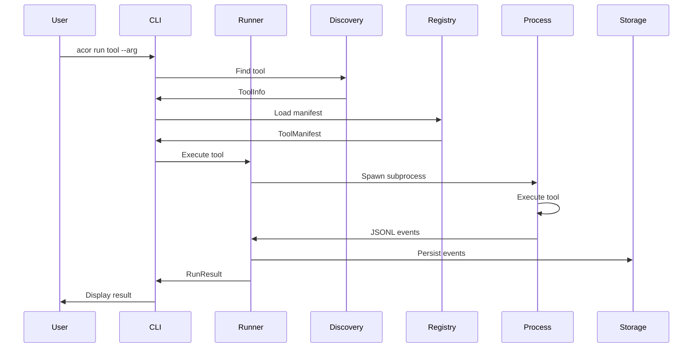
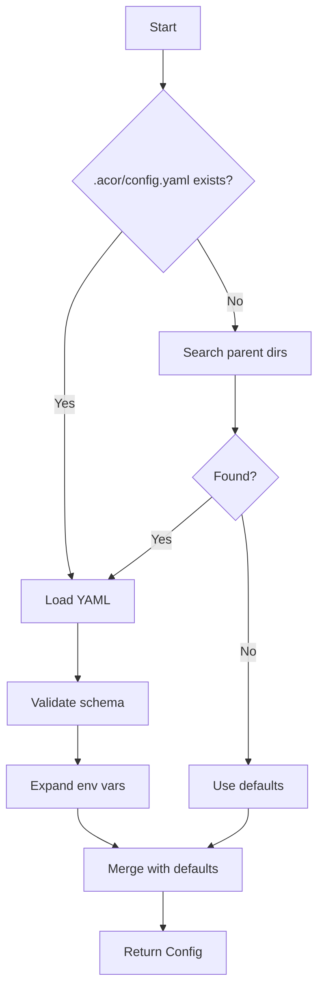

# ACOR Technical Design Document

## Architecture Overview

ACOR follows a modular, layered architecture that separates concerns and enables extensibility:

```
┌─────────────────────────────────────────────┐
│             CLI Interface Layer              │
│         (acor commands and options)          │
├─────────────────────────────────────────────┤
│           Orchestration Layer                │
│    (Runner, Discovery, Config, Registry)     │
├─────────────────────────────────────────────┤
│            Protocol Layer                    │
│     (JSONL Messages, Validation, Events)     │
├─────────────────────────────────────────────┤
│            Execution Layer                   │
│   (Process Management, Isolation, I/O)       │
├─────────────────────────────────────────────┤
│            Storage Layer                     │
│    (Artifacts, Logs, Checkpoints, Cache)     │
└─────────────────────────────────────────────┘
```

## Core Components

### 1. Configuration System (`config.py`)

```python
@dataclass
class AcorConfig:
    version: int = 1  # Configuration schema version
    acor_version: str = None  # ACOR version that created this config
    project: ProjectConfig
    discovery: DiscoveryConfig
    environment: EnvironmentConfig
    security: SecurityConfig
    storage: StorageConfig

@dataclass
class ProjectConfig:
    name: str
    tools_dirs: List[str] = field(default_factory=lambda: [".acor/tools/", "tools/"])
    runs_dir: str = ".runs/"
    registry_dir: str = ".acor/registry/"
    # Support both single dir and multiple dirs for backward compatibility
    @property
    def tools_dir(self) -> str:
        return self.tools_dirs[0] if self.tools_dirs else "tools/"

@dataclass
class DiscoveryConfig:
    patterns: Dict[str, List[str]]
    cache_ttl: int = 300
    auto_discover: bool = True

@dataclass
class EnvironmentConfig:
    base_allowlist: List[str]
    timeout_s: int = 1800
    heartbeat_grace_s: int = 90
    max_output_size: int = 30_000_000

@dataclass
class SecurityConfig:
    allow_network_egress: bool = False
    workspace_isolation: bool = True
    drop_privileges: bool = True
    resource_limits: Dict[str, Any]
```

**Configuration Loading Flow:**
1. Check for `.acor/config.yaml` in current directory
2. Traverse up to find project root with `.acor/`
3. Load and validate YAML against schema
4. Apply environment variable expansion
5. Merge with defaults

### 2. Protocol System (`protocol.py`)

```python
class ProtocolVersion(Enum):
    V1 = 1

@dataclass
class Message:
    v: int
    type: MessageType
    ts: str
    run_id: str
    trace_id: Optional[str] = None
    span_id: Optional[str] = None

class MessageType(Enum):
    START = "start"
    PROGRESS = "progress"
    HEARTBEAT = "heartbeat"
    ACTION_REQUIRED = "action_required"
    RESULT = "result"
    ERROR = "error"
    CANCELLED = "cancelled"
    LOG = "log"
    # Orchestrator-only types
    TASK_SUBMITTED = "task_submitted"
    TASK_STARTED = "task_started"
    TASK_DONE = "task_done"

class ProtocolEmitter:
    def __init__(self, run_id: str, version: ProtocolVersion = ProtocolVersion.V1):
        self.run_id = run_id
        self.version = version
    
    def emit(self, message: Message) -> None:
        """Emit JSONL message to stdout"""
        
    def emit_start(self, step: str, args: Dict) -> None:
        """Emit start event"""
        
    def emit_progress(self, step: str, pct: float, msg: str = "") -> None:
        """Emit progress update"""
        
    def emit_error(self, code: str, msg: str, hint: str = "", retryable: bool = False) -> None:
        """Emit error event"""
```

### 3. Runner System (`runner.py`)

```python
class ToolRunner:
    def __init__(self, config: AcorConfig, manifest: ToolManifest):
        self.config = config
        self.manifest = manifest
        self.run_id = self._generate_run_id()
        
    def run(self, tool_name: str, args: List[str]) -> RunResult:
        """Execute a tool with full lifecycle management"""
        # 1. Prepare execution environment
        # 2. Validate permissions and security
        # 3. Create isolated workspace
        # 4. Start process with timeout
        # 5. Stream and persist JSONL events
        # 6. Handle cancellation and cleanup
        # 7. Return structured result

class ExecutionContext:
    """Encapsulates the runtime environment for a tool"""
    workspace: Path
    environment: Dict[str, str]
    timeout: float
    cancel_signal: Path
    
class ProcessManager:
    """Manages subprocess lifecycle"""
    def spawn(self, cmd: List[str], context: ExecutionContext) -> Process
    def monitor(self, process: Process) -> Generator[Event, None, None]
    def terminate(self, process: Process, grace_period: float = 5.0)
```

**Execution Flow:**
```
User Input → CLI → Runner → Process Manager
                      ↓
                 Tool Process
                      ↓
              JSONL Events (stdout)
                      ↓
            Event Parser & Validator
                      ↓
         Storage (logs, artifacts, state)
                      ↓
              Result to User
```

### 4. Discovery System (`discovery.py`)

```python
class ToolDiscovery:
    def __init__(self, config: DiscoveryConfig, project_config: ProjectConfig):
        self.config = config
        self.project_config = project_config
        self.cache = DiscoveryCache()
        
    def discover(self, paths: Optional[List[Path]] = None) -> List[ToolInfo]:
        """Discover tools in configured directories"""
        # Use provided paths or configured tools_dirs
        search_paths = paths or [Path(d) for d in self.project_config.tools_dirs]
        
        all_tools = []
        for path in search_paths:
            if not path.exists():
                continue
            # 1. Check cache validity for this path
            # 2. Scan filesystem for matching patterns
            # 3. Detect language and entry point
            # 4. Extract metadata
            # 5. Update cache
            # 6. Aggregate results
            tools = self._discover_in_path(path)
            all_tools.extend(tools)
        
        return all_tools
    
    def _discover_in_path(self, path: Path) -> List[ToolInfo]:
        """Discover tools in a single directory"""
        # Implementation for single path discovery

@dataclass
class ToolInfo:
    name: str
    path: Path
    language: ToolLanguage
    entry_point: str
    has_manifest: bool
    detected_at: datetime

class ToolLanguage(Enum):
    PYTHON = "python"
    BASH = "bash"
    NODE = "node"
    UNKNOWN = "unknown"

class LanguageDetector:
    def detect(self, file_path: Path) -> ToolLanguage:
        """Detect tool language from file"""
        # Check extension (.py, .sh, .js)
        # Check shebang line
        # Check file content patterns
```

### 5. Registry System (`registry.py`)

```python
@dataclass
class ToolManifest:
    name: str
    version: str  # Tool semantic version (e.g., "1.2.3")
    protocol_version: int  # JSONL protocol version supported
    min_acor_version: str = None  # Minimum ACOR version required
    inputs: List[InputSpec]
    permissions: PermissionSpec
    resources: ResourceSpec
    exit_codes: Dict[str, int]
    health: HealthSpec

class ManifestLoader:
    def load(self, tool_name: str) -> ToolManifest:
        """Load and validate tool manifest"""
        
    def validate(self, manifest: ToolManifest) -> List[ValidationError]:
        """Validate manifest against schema"""

class PermissionValidator:
    def check(self, manifest: ToolManifest, config: SecurityConfig) -> bool:
        """Check if tool permissions are allowed"""
```

### 6. Error System (`errors.py`)

```python
@dataclass
class ErrorCode:
    code: str
    error_class: ErrorClass
    retryable: bool
    default_action: str

class ErrorClass(Enum):
    USER_ERROR = "user_error"
    RETRYABLE = "retryable"
    INFRA_ERROR = "infra_error"
    POLICY_ERROR = "policy_error"
    UNKNOWN = "unknown"

class ErrorRegistry:
    def __init__(self):
        self.codes = self._load_error_codes()
        
    def get_error(self, code: str) -> ErrorCode:
        """Get error details by code"""
        
    def suggest_action(self, error: ErrorCode) -> str:
        """Suggest recovery action for error"""
```

## Data Flows

### Tool Execution Flow



### Configuration Loading Flow



## API Specifications

### CLI Commands

```bash
# Initialize project
acor init [--template <type>] [--force]

# List available tools
acor list [--format json|table] [--filter <pattern>]

# Describe tool capabilities
acor describe <tool> [--manifest] [--permissions]

# Run a tool
acor run <tool> [args...] [--timeout <s>] [--no-stream]

# Explain ACOR system to AI agents
acor explain [--format markdown|json] [--include-examples] [--protocol-version <v>]

# Validate configuration and manifests
acor validate [--strict] [--fix]

# View run logs
acor logs <run-id> [--follow] [--format json|text]

# Generate tool template
acor template <language> [--name <name>] [--output <dir>]

# Clean old runs
acor clean [--keep <n>] [--older-than <days>]
```

### Python API

```python
from acor import Acor, ToolRunner, ProtocolEmitter

# Initialize ACOR
acor = Acor(config_path=".acor/config.yaml")

# Discover tools
tools = acor.discover()

# Run a tool
result = acor.run("data_processor", ["--input", "data.json"])

# Use protocol emitter in tools
emitter = ProtocolEmitter(run_id="r-123")
emitter.emit_start("process", {"input": "data.json"})
emitter.emit_progress("process", 50.0, "Processing batch 2/4")
emitter.emit_result(status="ok", artifacts=[{"path": "output.json"}])
```

## Security Model

### Permission Levels

1. **Minimal** (Default)
   - Read/write only in workspace
   - No network access
   - No system commands
   - Resource limits enforced

2. **Standard**
   - Workspace + specified paths
   - Allowlisted network endpoints
   - Selected system commands
   - Higher resource limits

3. **Privileged**
   - Full filesystem access
   - Unrestricted network
   - All system commands
   - No resource limits
   - Requires explicit approval

### Isolation Mechanisms

```python
class SecurityManager:
    def create_sandbox(self, manifest: ToolManifest) -> Sandbox:
        """Create isolated execution environment"""
        
    def validate_permissions(self, requested: PermissionSpec, allowed: SecurityConfig) -> bool:
        """Check if permissions are allowed"""
        
    def apply_limits(self, process: Process, limits: ResourceSpec):
        """Apply resource limits to process"""
```

## Storage Schema

### Directory Structure
```
.runs/
├── r-<run_id>/
│   ├── events.jsonl         # All JSONL events
│   ├── metadata.json        # Run metadata
│   ├── work/               # Tool workspace
│   │   └── .checkpoints/   # Checkpoint files
│   ├── logs/
│   │   ├── stdout.log      # Raw stdout
│   │   └── stderr.log      # Stderr output
│   └── artifacts/          # Output artifacts
└── cache/
    ├── discovery.json      # Tool discovery cache
    └── manifests/          # Cached manifests
```

### Event Storage Format
```json
{
  "v": 1,
  "type": "progress",
  "ts": "2025-01-01T12:00:00Z",
  "run_id": "r-abc123",
  "step": "process",
  "pct": 75.0,
  "msg": "Processing batch 3/4"
}
```

## Performance Considerations

### Optimization Strategies

1. **Discovery Caching**
   - Cache TTL: 5 minutes default
   - Invalidate on filesystem changes
   - Background refresh option

2. **Lazy Loading**
   - Load manifests on demand
   - Defer validation until execution
   - Stream large outputs

3. **Process Pooling**
   - Reuse Python interpreters
   - Pre-warm Node.js processes
   - Connection pooling for network

### Benchmarks

| Operation | Target | Acceptable | Maximum |
|-----------|--------|------------|---------|
| Tool discovery | <50ms | <100ms | 500ms |
| Startup overhead | <30ms | <50ms | 100ms |
| Message parsing | <1ms | <2ms | 5ms |
| Checkpoint save | <10ms | <20ms | 50ms |

## Extension Points

### Plugin Architecture

```python
class AcorPlugin(ABC):
    @abstractmethod
    def on_discovery(self, tools: List[ToolInfo]) -> List[ToolInfo]:
        """Modify discovered tools"""
        
    @abstractmethod
    def on_pre_run(self, tool: str, args: List[str]) -> Tuple[str, List[str]]:
        """Modify tool execution"""
        
    @abstractmethod
    def on_event(self, event: Message) -> Optional[Message]:
        """Process or modify events"""
```

### Custom Languages

```python
class LanguageHandler(ABC):
    @abstractmethod
    def detect(self, path: Path) -> bool:
        """Check if this handler supports the file"""
        
    @abstractmethod
    def get_runtime(self, path: Path) -> Runtime:
        """Get runtime for execution"""
        
    @abstractmethod
    def prepare_command(self, entry: Path, args: List[str]) -> List[str]:
        """Prepare execution command"""
```

## AI Agent Integration

### The `acor explain` Command

The `acor explain` command provides comprehensive documentation about the ACOR system, specifically designed for AI agents to understand and use the tool effectively.

```python
class ExplainCommand:
    def __init__(self, config: AcorConfig):
        self.config = config
        
    def generate_explanation(self, format: str = "markdown", 
                            include_examples: bool = True,
                            protocol_version: int = 1) -> str:
        """Generate comprehensive ACOR documentation for AI agents"""
        
        sections = [
            self._overview(),
            self._protocol_spec(protocol_version),
            self._available_tools(),
            self._command_reference(),
            self._error_handling(),
            self._best_practices()
        ]
        
        if include_examples:
            sections.append(self._usage_examples())
            
        return self._format_output(sections, format)
    
    def _overview(self) -> Dict:
        """System overview and architecture"""
        return {
            "title": "ACOR System Overview",
            "content": """
            ACOR implements the AI + CLI Orchestration Pattern where:
            - AI agents provide intelligence and decision-making
            - CLI tools provide deterministic execution
            - Communication happens via JSONL streaming protocol
            - Tools are discovered automatically from configured directories
            """
        }
    
    def _protocol_spec(self, version: int) -> Dict:
        """JSONL protocol specification"""
        return {
            "title": "Protocol Specification",
            "version": version,
            "message_types": [...],
            "error_codes": [...],
            "examples": [...]
        }
```

**Output Example for `acor explain --format markdown`:**

```markdown
# ACOR (AI-CLI-Orchestration-Runner) System

## Overview
ACOR enables AI agents to orchestrate deterministic CLI tools through a structured JSONL protocol...

## Protocol Version 1
### Message Types
- `start`: Indicates tool execution beginning
- `progress`: Reports completion percentage
- `action_required`: Requests AI decision
...

## Available Tools
Current project has 5 tools discovered:
1. **data_processor** (Python)
   - Location: tools/data_processor/cli.py
   - Inputs: --input, --output
   - Permissions: filesystem read/write
   
2. **file_migrator** (Bash)
   - Location: custom/scripts/migrate.sh
   ...

## Command Reference
### Running Tools
```bash
acor run <tool> [arguments]
```
...

## Error Handling
### Error Classes and Recovery
- `E_INPUT_NOT_FOUND`: User error, ask for correct path
- `E_TRANSIENT_NET`: Retryable, use exponential backoff
...

## Best Practices for AI Agents
1. Always check for `action_required` events
2. Monitor `progress` events for long-running tools
3. Respect `heartbeat` timeouts
...
```

## Integration Patterns

### Claude Code Integration

```yaml
# .claude/commands/run-tool.md
---
description: Run ACOR tool
allowed-tools: [Bash]
---

Run the specified tool using ACOR:

```bash
acor run $ARGUMENTS
```

Monitor the JSONL output and handle `action_required` events.
```

### CI/CD Integration

```yaml
# GitHub Actions example
- name: Run ACOR Tool
  run: |
    pip install acor
    acor validate --strict
    acor run test_suite --ci-mode
```

### Container Integration

```dockerfile
FROM python:3.11-slim
RUN pip install acor
COPY .acor /app/.acor
COPY tools /app/tools
WORKDIR /app
ENTRYPOINT ["acor", "run"]
```

## Migration Strategy

### From Embedded Pattern

1. **Extract existing tools**
   ```bash
   mkdir -p .acor/registry tools
   cp project/tools/* tools/
   ```

2. **Generate config**
   ```bash
   acor init --from-existing
   ```

3. **Update tool imports**
   ```python
   # Old: from _lib.protocol import emit_start
   # New:
   from acor.protocol import emit_start
   ```

4. **Validate migration**
   ```bash
   acor validate --strict
   acor run <tool> --dry-run
   ```

## Monitoring & Observability

### Metrics

```python
class MetricsCollector:
    def record_run(self, tool: str, duration: float, status: str):
        """Record tool run metrics"""
        
    def record_event(self, event_type: str, latency: float):
        """Record event processing metrics"""
        
    def export(self, format: str) -> str:
        """Export metrics in specified format"""
```

### Logging Levels

| Level | Usage |
|-------|-------|
| DEBUG | Detailed execution flow |
| INFO | Normal operations |
| WARNING | Recoverable issues |
| ERROR | Failed operations |
| CRITICAL | System failures |

### Tracing

```python
class TraceContext:
    trace_id: str
    span_id: str
    parent_span_id: Optional[str]
    
    def child_span(self) -> "TraceContext":
        """Create child span context"""
```

## Versioning and Compatibility

### Version Management System

ACOR implements comprehensive versioning to ensure compatibility across evolving components:

```python
from typing import Tuple
from packaging import version

class VersionManager:
    """Manages version compatibility across ACOR components"""
    
    def __init__(self, acor_version: str):
        self.acor_version = version.parse(acor_version)
        self.supported_protocols = {1}  # Set of supported protocol versions
    
    def check_config_version(self, config_version: int) -> bool:
        """Verify configuration schema version compatibility"""
        return config_version in {1}  # Currently only v1 supported
    
    def check_protocol_version(self, protocol_version: int) -> bool:
        """Verify JSONL protocol version compatibility"""
        return protocol_version in self.supported_protocols
    
    def check_tool_compatibility(self, manifest: ToolManifest) -> Tuple[bool, str]:
        """Check if tool is compatible with current ACOR version"""
        # Check protocol version
        if not self.check_protocol_version(manifest.protocol_version):
            return False, f"Protocol v{manifest.protocol_version} not supported"
        
        # Check minimum ACOR version requirement
        if manifest.min_acor_version:
            min_version = version.parse(manifest.min_acor_version)
            if self.acor_version < min_version:
                return False, f"Requires ACOR >= {manifest.min_acor_version}"
        
        return True, "Compatible"
    
    def migrate_config(self, old_config: dict, old_version: int) -> dict:
        """Migrate configuration to current version"""
        # Future: implement migration logic between versions
        if old_version == 1:
            return old_config
        raise ValueError(f"Cannot migrate from config version {old_version}")
```

### Version Initialization

When `acor init` creates a new project:

```python
def init_project(project_name: str) -> None:
    """Initialize ACOR project with versioned artifacts"""
    import acor
    
    config = {
        "version": 1,  # Configuration schema version
        "acor_version": acor.__version__,  # ACOR version creating this
        "project": {
            "name": project_name,
            "tools_dirs": [".acor/tools/"]
        },
        # ... rest of config
    }
    
    # Write versioned config
    config_path = Path(".acor/config.yaml")
    config_path.parent.mkdir(parents=True, exist_ok=True)
    
    with open(config_path, 'w') as f:
        yaml.dump(config, f, sort_keys=False)
    
    # Create version info file
    version_info = {
        "created_at": datetime.utcnow().isoformat(),
        "created_by": acor.__version__,
        "schema_versions": {
            "config": 1,
            "protocol": 1
        }
    }
    
    with open(".acor/version.json", 'w') as f:
        json.dump(version_info, f, indent=2)
```

### Compatibility Checking

During tool execution:

```python
def validate_compatibility(tool_name: str) -> None:
    """Validate tool compatibility before execution"""
    version_mgr = VersionManager(acor.__version__)
    manifest = load_manifest(tool_name)
    
    # Check compatibility
    compatible, message = version_mgr.check_tool_compatibility(manifest)
    if not compatible:
        raise CompatibilityError(
            f"Tool '{tool_name}' incompatible with ACOR {acor.__version__}: {message}"
        )
    
    # Warn about deprecations
    if manifest.protocol_version < version_mgr.latest_protocol_version:
        warnings.warn(
            f"Tool '{tool_name}' uses protocol v{manifest.protocol_version}. "
            f"Consider updating to v{version_mgr.latest_protocol_version}"
        )
```

### Version Information Commands

```bash
# Show version information
acor version --detailed

# Output:
# ACOR Version: 1.0.0
# Configuration Schema: v1
# Supported Protocols: v1
# Python: 3.8.10
# Project Config: v1 (created by ACOR 1.0.0)

# Validate all versions
acor validate --check-versions

# Upgrade configuration to latest version
acor upgrade --config
```

## Future Enhancements

### Version 1.1
- Remote tool execution
- Tool marketplace/registry
- Web UI for monitoring
- Kubernetes operator

### Version 1.2
- Tool composition/pipelines
- Event streaming (Kafka, Redis)
- Distributed tracing (OpenTelemetry)
- Multi-tenant support

### Version 2.0
- GraphQL API
- Tool versioning and rollback
- A/B testing framework
- Cost tracking and optimization